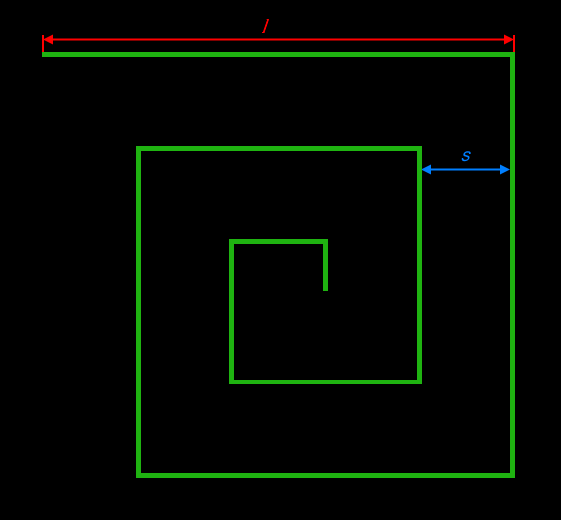
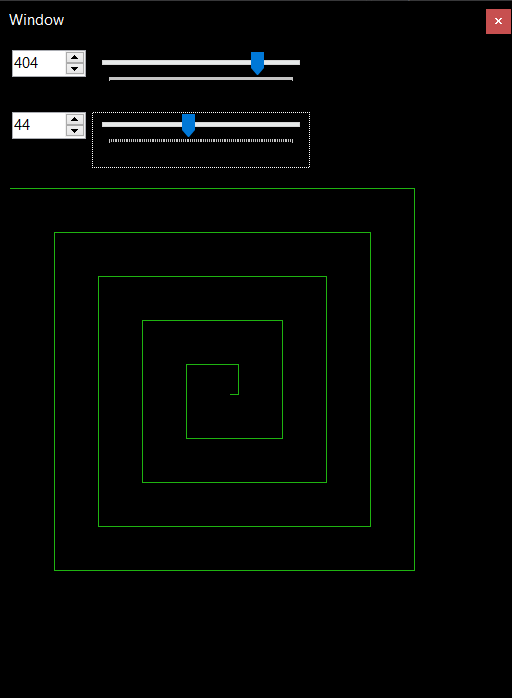
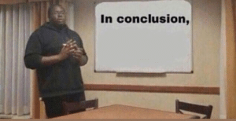

# Postup při řešení rekurzivní úlohy

## **Přibližné zadání**
Gnerování spirály o délce *l* a rozestupy *s* rekurzivním způsobem.\

## **Řešení**
Algoritmus bych rozdělil na tři (čtyři) nejdůležitější části:
- ### **Výchozí podmínka**
    Ukončení rekurze nastává při nulové či záporné délce segmentu.

- ### **Koncová pozice čáry**
    Konec čáry je vypočítán s ohledem k orientaci kreslení.

- ### (Kreslení čáry)

- ### **Rekurzivní volání**
    Funkce je zavolána znovu se zkrácenou délkou a otočeným směrem.

Při spracování bylo využito jazyka **C#** a technologie **Windows Forms**.
Obě možnsti nabízeli rychlé protypování a jednoduchý přítup ke kreslícím funkcím.

Hlavní část kódu se nachází v souboru [`MainForm.cs`](./src/MainForm.cs) v metoďe [`DrawSpiral`](./src/MainForm.cs#L82-L104)

## **Popis rozhraní**
V aplikaci lze nalézt dva posuvníky pro úpravu délky hrany a mezer mezi hranami.\

## **Závěr**

U většiny problémů, kde se nabízí možnost rekurze rád použiji běžný cyklus.
S rekurzí se spokojím snad jen v případech s procházením stromové struktury.
