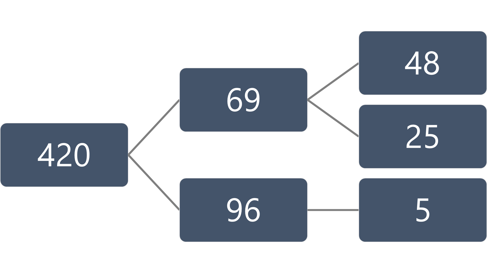
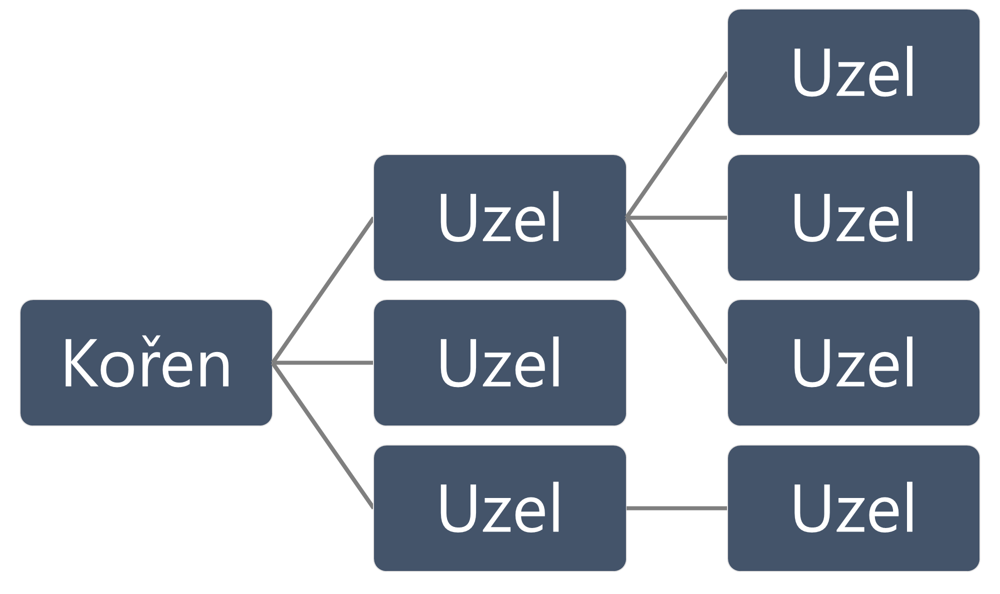

## Obsah
[Algoritmy](#algoritmy)
- [Selection sort](#selection-sort)
- [Bubble sort](#bubble-sort)
- [Insertion sort](#insertion-sort)
- [Heap sort](#heap-sort)
    - [Halda](#halda)
    - [Binární strom](#binární-strom)
- [Merge sort](#merge-sort)
    - [Složitost](#složitost)
    - [Princip slévání](#princip-slévání)
- [Quick sort](#quick-sort)
- [Counting sort](#counting-sort)
    - [Optimalizace](#optimalizace)

[Kód](#kód)

[Porovnání složitostí](#porovnání-složitostí)

# Algoritmy

## Selection sort
Průchodem hledáme největší nebo nejmenší prvek. Když ho najdeme tak ho zařadíme na začátek nebo konec a o tuto část zmenšíme příští hledání. Opakujeme dokud pole není seřazené.

[Kód](./SelektioSort/Program.cs)

## Bubble sort
Procházíme dokud není seřazeno. Vždy vememe `n`-tý a `n+1`-tý prvek a porovnáme je. Pokud zjistíme, že nám pořadí nevyhovuje, tak je vyměníme. Lehčí prvky nám tedy probublávají na konec.

[Kód](./BaubySort/Program.cs)

## Insertion sort
Na každém prvku zkontroluje jestli by mohl sedět v řadě. Pokud ne, tak ťapeme zpátky dokud nenajdeme vhodné místo pro vložení vybraného prveku.

[Kód](./HateInsertKeySort/Program.cs)

## Heap sort
V první části prvky uspořádáme do [haldy](#halda) ([binární](#binární-halda)). Následně můžeme vzít prvek na první pozici (kořen stromu) a přesunout ho na konec řady. Při příštím opakování bereme v potaz o prvek méňe.

### Halda
[Stromová](#strom) struktura, která splňuje, že každý potomek má hodnotu menší nebo stejnou jako rodič. Z toho vyplívá, že kořen je prvek s nejvyšší hodnotou.

#### Binární halda
Halda, která splňuje podmínky [binárního stromu](#binární-strom).
\

### Binární strom
[Strom](#strom), který splňuje, že jeho počet dětí je právě `≤2`.
\

#### Strom
Datová struktura, jejíž graf se podobá opravdovému živému stromu. Každý uzel může mít své potomky. Pokud žádné nemá nazýváme ho *list*. Uzel, který nemá žádného rodiče, je *kořen*.
\

[Kód](./HaldaSort/Program.cs)

## Merge sort
Rekurzivně dělíme prvky až se dostaneme k jednoduchému porovnávání. Cestou zpátky z rekurze pak skládáme ([sléváme](#princip-slévání)) zpátky. Už stačí jen opakovat a pokud prvky zdrojů byly seřazené tak na koneci skončíme s jednou sadou seřazených prvků.

### Složitost
Časová složitost merge sortu je stálá napříč případy a to příjemná `nlog(n)`. Mezitím prostorová nemusí být ideální pro každé využití a je `O(n)`.

### Princip slévání
Máme dvě kolekce prvků, které potřebujeme slét. Držíme si tedy pozici z první, z druhé a pozici pro destinaci. Porovnáme prvky na kterých stojíme v prvním a druhém zdroji a vložíme do cíle. Pozice samozřejmě příslušně změníme.

[Kód](./MargeSort/Program.cs)

## Quick sort
Vybereme si jeden prvek (klidně náhodný). Podle tohoto prvku nyní budeme rozdělovat zbytek na menší a větší. Stejně se pak chováme k oboum polovinám.

[Kód](./QuickieSort/Program.cs)

## Counting sort
...

### Optimalizace
...

[Kód](./CounterProductiveSort/Program.cs)

# Kód
- [Selection sort](./SelektioSort/Program.cs)
- [Bubble sort](./BaubySort/Program.cs)
- [Insertion sort](./HateInsertKeySort/Program.cs)
- [Heap sort](./HaldaSort/Program.cs)
- [Merge sort](./MargeSort/Program.cs)
- [Quick sort](./QuickieSort/Program.cs)
- [Counting sort](./CounterProductiveSort/Program.cs)

# Porovnání složitostí
| Sort      | Časová      | Prostorová |
|-----------|-------------|------------|
| Selection | O(n^2)      | O(1)       |
| Bubble    | O(n^2)      | O(1)       |
| Insertion | O(n^2)      | O(1)       |
| Heap      | O(n log(n)) | O(1)       |
| Merge     | O(n log(n)) | O(n)       |
| Quick     | O(n^2)      | O(n)       |
| Counting  | O(n +k)     | O(k)       |